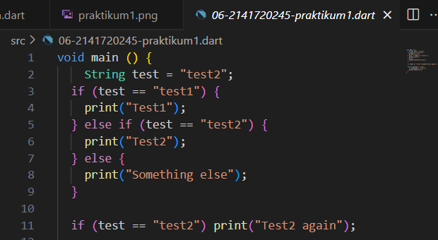
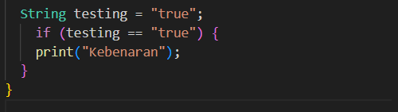
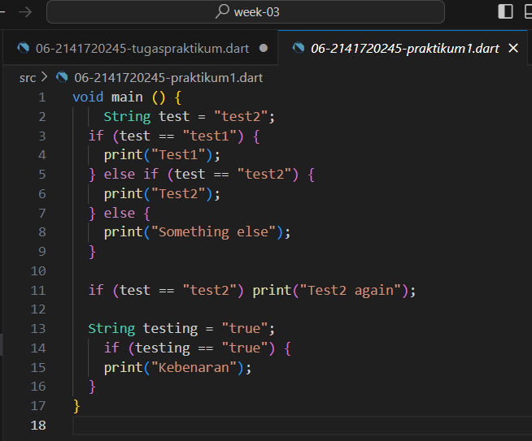
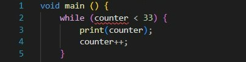
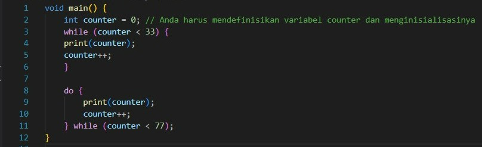
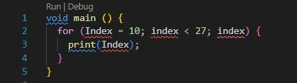
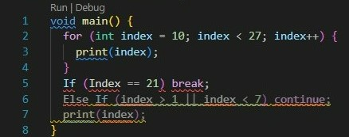
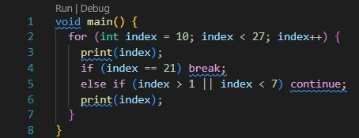
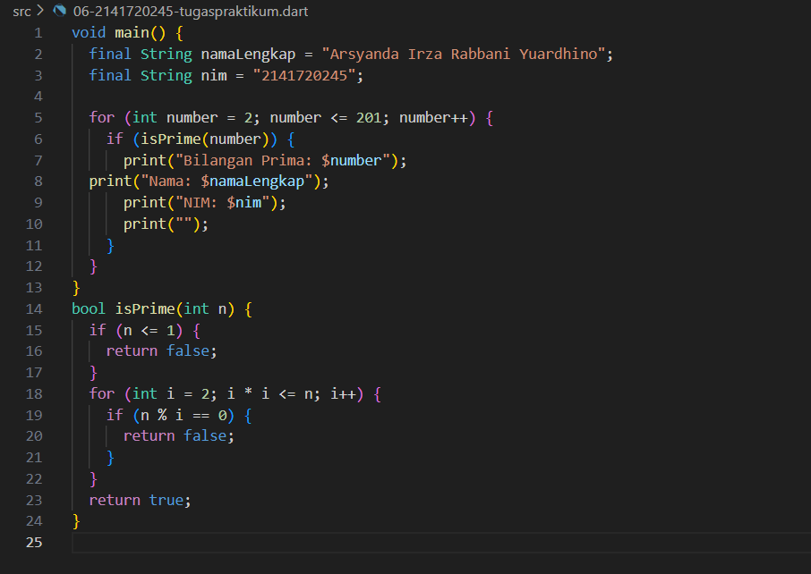

# Tugas Praktikum Pertemuan 3

### Nama : Arsyanda Irza Rabbani Yuardhino
### NIM : 2141720245
### Kelas : TI-3F

# Praktikum 1: Menerapkan Control Flows ("if/else")

## Langkah 1
#### Ketik atau salin kode program berikut ke dalam fungsi main().
###### String test = "true";
###### if (test) {
######    print("Kebenaran");
###### }

## Langkah 2
#### Silakan coba eksekusi (Run) kode pada langkah 1 tersebut. Apa yang terjadi? Jelaskan!

###### Kode diatas error karena penulisan huruf i pada "else If" dan huruf e pada "Else" harus huruf kecil.
###### Kode diperbaiki dengan menulis huruf kecil pada "else If" dan huruf kecil pada "Else".

## Langkah 3
#### Tambahkan kode program berikut, lalu coba eksekusi (Run) kode Anda. Apa yang terjadi ? Jika terjadi error, silakan perbaiki namun tetap menggunakan if/else.

###### Kode diatas error karena data String belum dikonversi ke boolean, dalam bahasa Dart, sebuah kondisi dalam sebuah pernyataan if harus merupakan ekspresi boolean, yaitu true atau false. 
#### Kode diperbaiki dengan menambahkan perintah "==" untuk mengkonversi nilai String dengan nilai boolean.

## Kode yang sudah diperbaiki

# Praktikum 2: Menerapkan Perulangan "while" dan "do-while"

## Langkah 1
#### Ketik atau salin kode program berikut ke dalam fungsi main().
###### while (counter < 33) {
######   print(counter);
######   counter++;
###### }

## Langkah 2
#### Silakan coba eksekusi (Run) kode pada langkah 1 tersebut. Apa yang terjadi? Jelaskan! Lalu perbaiki jika terjadi error.

###### Kode diatas error karena perlu mendefinisikan variabel counter dan menambahkan kurung kurawal {} untuk mengelilingi blok pernyataan while. 

## Langkah 3
#### Tambahkan kode program berikut, lalu coba eksekusi (Run) kode Anda. Apa yang terjadi ? Jika terjadi error, silakan perbaiki namun tetap menggunakan do-while.

###### Kode diatas tidak error karena perulangan while akan berhenti ketika nilai counter sama dengan 33 lalu dilanjukan dengan perulangan do-while hingga counter sama dengan 76 dan output counter 76.

# Praktikum 3: Menerapkan Perulangan "while" dan "do-while"

## Langkah 1
#### Ketik atau salin kode program berikut ke dalam fungsi main().
###### for (Index = 10; index < 27; index) {
######   print(Index);
###### }

## Langkah 2
#### Silakan coba eksekusi (Run) kode pada langkah 1 tersebut. Apa yang terjadi? Jelaskan! Lalu perbaiki jika terjadi error.

###### Kode diatas error, karena terdapat beberapa masalah dalam penggunaan loop for. Di dalam loop for, perlu mendefinisikan variabel indeks (biasanya dengan tipe int) dan menginisialisasinya, mendefinisikan kondisi berhenti, dan mengatur bagaimana variabel indeks diperbarui setiap iterasi.

## Langkah 3
#### Tambahkan kode program berikut di dalam for-loop, lalu coba eksekusi (Run) kode Anda. Apa yang terjadi ? Jika terjadi error, silakan perbaiki namun tetap menggunakan for dan break-continue

###### Kode diatas tidak error karena menggunakan If dan Else If dengan huruf kapital

## Kode yang sudah diperbaiki

# Tugas Praktikum
#### 1. Silakan selesaikan Praktikum 1 sampai 3, lalu dokumentasikan berupa screenshot hasil pekerjaan beserta penjelasannya!
###### Selesai

#### 2. Buatlah sebuah program yang dapat menampilkan bilangan prima dari angka 0 sampai 201 menggunakan Dart. Ketika bilangan prima ditemukan, maka tampilkan nama lengkap dan NIM Anda.
## Program bilangan prima 0 sampai 201

#### 3. Kumpulkan berupa link commit repo GitHub pada tautan yang telah disediakan di grup Telegram!
###### Selesai
